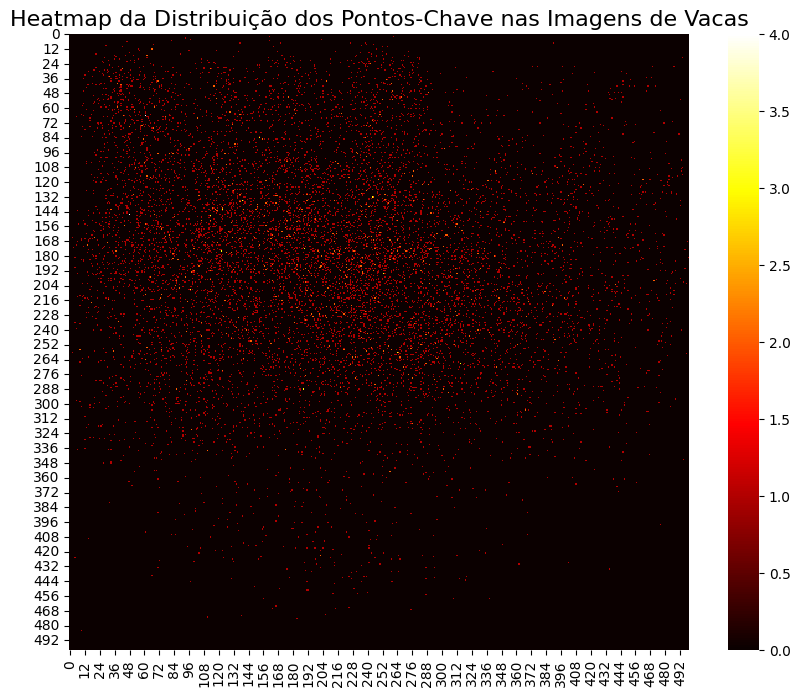
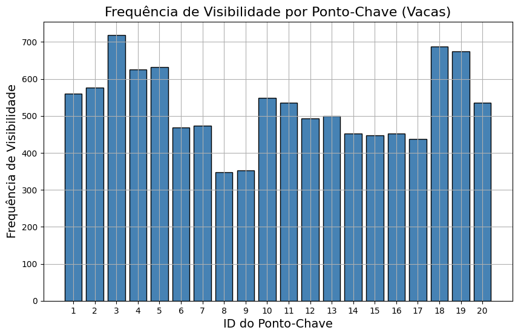
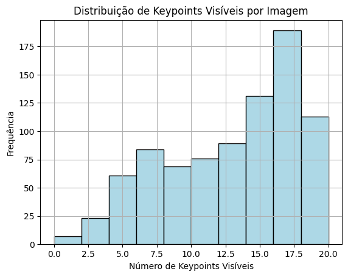
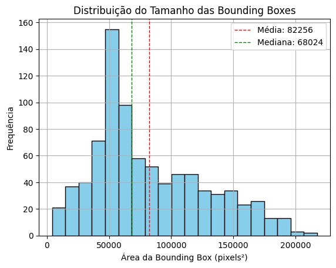

# **AnimalPose - Estimativa de Pose para Bovinos**

Este projeto tem como objetivo a implementação de estimativa de pose para bovinos, usando o **ANIMAL-POSE DATASET** (https://www.kaggle.com/datasets/bloodaxe/animal-pose-dataset). Abaixo estão descritas as etapas seguidas durante o projeto, incluindo a análise exploratória, filtragem do dataset, resultados finais e conclusões.

---

## **1. Análise Exploratória do Dataset**

Para iniciar, foi realizada uma análise exploratória do dataset, onde focamos nas imagens que contêm **bovinos** (categoria 5). O dataset foi analisado para destacar aspectos importantes, como a distribuição dos pontos-chave e das caixas delimitadoras (bounding boxes).

### **Heatmap da Distribuição dos Pontos-Chave nas Imagens de Vacas**

**Descrição**: O heatmap apresenta a distribuição dos pontos-chave ao longo das imagens das vacas. Cada ponto vermelho no gráfico representa a posição de um ponto-chave em uma imagem de vaca. As áreas mais quentes (em amarelo) indicam regiões com maior concentração de pontos-chave.

**Análise dos Resultados**:
- O heatmap demonstra uma maior densidade de pontos-chave na região superior da imagem, sugerindo que as anotações estão mais concentradas nas partes do corpo superior das vacas, como a cabeça e o tronco.
- Isso pode ser explicado pelo fato de que, para a estimativa de pose, é importante capturar os principais movimentos dessas áreas, como a articulação do pescoço e das patas dianteiras.

### **Frequência de Visibilidade por Ponto-Chave (Vacas)**

**Descrição**: Este gráfico de barras mostra a frequência com que cada ponto-chave é visível nas imagens de vacas. O eixo X representa os IDs dos pontos-chave (1 a 20), enquanto o eixo Y indica quantas vezes cada ponto foi anotado como visível.

**Análise dos Resultados**:
- Os pontos-chave com IDs 2, 3, 4, 18 e 19 são os mais frequentemente anotados, correspondendo provavelmente às articulações importantes, como pernas e cabeça.
- Pontos-chave como 7, 8 e 9 têm menos visibilidade, o que pode indicar que são mais difíceis de identificar em certas poses ou que estão frequentemente obstruídos.

### **Boxplot das Áreas das Caixas Delimitadoras (Vacas)**

**Descrição**: O boxplot mostra a distribuição das áreas das caixas delimitadoras que contêm as vacas. A área de cada caixa delimitadora é calculada multiplicando a largura pela altura da caixa.

**Análise dos Resultados**:
- A mediana da área das caixas delimitadoras está em torno de 100.000 pixels quadrados.
- O gráfico também apresenta alguns **outliers**, indicando imagens com vacas particularmente grandes ou pequenas, o que sugere uma variação considerável no tamanho das vacas nas imagens.

---

## **2. Filtragem do Dataset e Etapas do Processamento de Imagem**

Após a análise exploratória, o dataset foi **filtrado** para garantir que apenas imagens da categoria **bovinos (categoria 5)** fossem processadas. Em seguida, foi feito o processamento das imagens de vacas para desenhar as **bounding boxes** e os **pontos-chave**.

### **Etapas do Processamento de Imagem**:

1. **Carregar a Imagem**: A imagem correspondente ao `image_id` é carregada a partir do dataset.
2. **Aplicar Bounding Box**: Uma bounding box é desenhada ao redor da vaca com base nas coordenadas fornecidas no JSON (`x, y, largura, altura`).
3. **Plotar Pontos-Chave**: Os pontos-chave visíveis são plotados na imagem para destacar articulações e partes importantes do corpo do bovino.
4. **Múltiplas Bounding Boxes**: Em imagens com mais de um bovino, são desenhadas múltiplas caixas e pontos-chave.

---

## **3. Resultados Finais com Gráficos e Tabelas**

### **Distribuição de Keypoints Visíveis por Imagem**

**Análise**:
- A maioria das imagens contém entre 15 e 20 pontos-chave visíveis, o que indica uma anotação bem completa para a maior parte do dataset.
- No entanto, há algumas imagens com menos de 10 pontos-chave visíveis, possivelmente devido a poses complexas ou obstruções na imagem.

### **Distribuição do Tamanho das Bounding Boxes**

**Análise**:
- A **média** do tamanho das bounding boxes é de aproximadamente **82.256 pixels²**, enquanto a **mediana** é de **68.024 pixels²**.
- A maior parte das caixas delimitadoras tem tamanho concentrado em torno de 50.000 pixels², com algumas exceções de áreas maiores, que representam vacas fotografadas de perto ou com maior parte do corpo visível.

---

## **4. Conclusões e Trabalhos Futuros**

### **Principais Aprendizados**:
- A análise exploratória do dataset mostrou que as anotações de pontos-chave são consistentes para a maioria das imagens, com muitos pontos visíveis em áreas como a cabeça e as pernas dos bovinos.
- O processamento das imagens de vacas foi bem-sucedido ao aplicar bounding boxes e plotar os keypoints, mesmo em imagens com múltiplos animais.
- Notou-se que algumas imagens apresentavam menos pontos-chave visíveis, sugerindo possíveis dificuldades em anotar corretamente todos os keypoints em certos cenários.

### **Limitações**:
- Algumas imagens possuem menos keypoints visíveis, o que pode ser um desafio para modelos de estimativa de pose que dependem de um conjunto completo de pontos.
- O dataset contém uma grande variação no tamanho das bounding boxes, o que pode exigir modelos mais robustos para lidar com diferentes escalas e poses dos animais.

### **Sugestões para Trabalhos Futuros**:
- **Melhorar a Detecção de Keypoints Ocultos**: Desenvolver técnicas para estimar melhor keypoints ocultos ou não visíveis, utilizando aprendizado profundo para preencher lacunas quando partes do corpo estão obstruídas.
- **Aprimorar o Modelo de Estimativa de Pose**: Considerar modelos mais robustos, como **OpenPose** ou **DeepLabCut**, especificamente ajustados para lidar com as variações de poses em bovinos.
- **Aplicação em Ambientes Reais**: Futuras implementações poderiam focar em aplicar este tipo de estimativa de pose em contextos reais, como fazendas, onde a detecção de movimentos e posturas poderia ajudar a monitorar a saúde dos animais.

---

